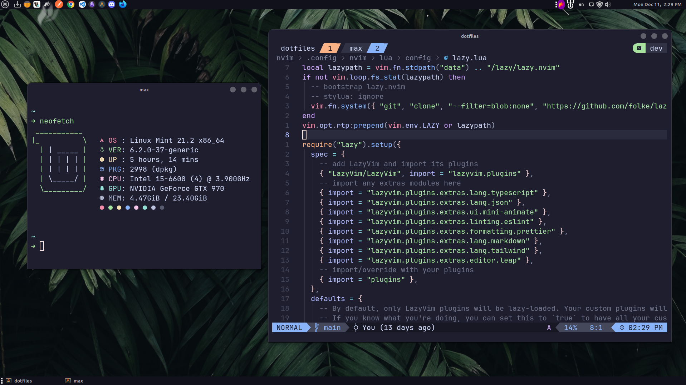
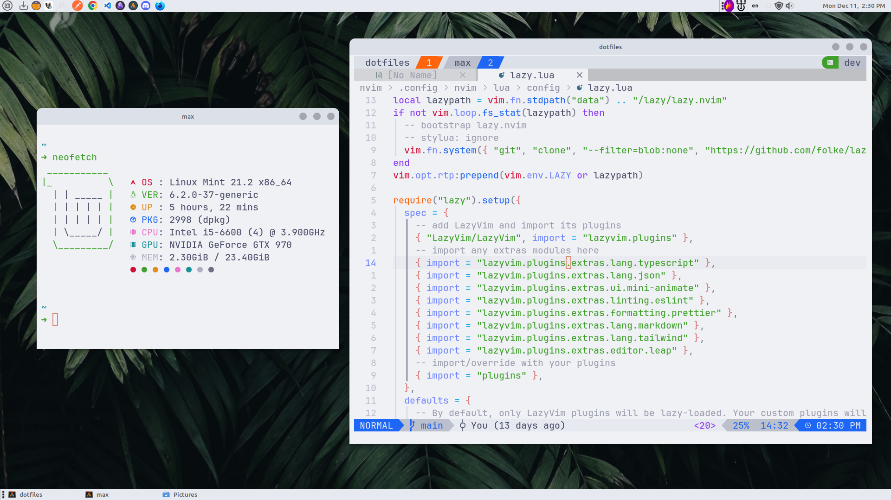

<h1 align="center">
Maxime's dotfiles <br>

</h1>
<br />

<p align="center">

 <br>
</p>

You want to know more about my setup -> [maximerichard.dev/setup](https://maximerichard.dev/setup).

## Terminal and tools

As a theme, I love [Catppuccin](https://catppuccin.com/) :heart:, the Latte and Mocha version. My font is the [JetBrains Mono](https://www.jetbrains.com/lp/mono/) with [Nerd fonts](https://www.nerdfonts.com/).

- [Stow](https://www.gnu.org/software/stow/), to maintain my dotfiles repository
- [Alacritty](https://alacritty.org/), terminal
- [tmux](https://github.com/tmux/tmux), terminal multiplexer
- [Oh My Zsh](https://ohmyz.sh/), zsh plugin manager
- [Spaceship](https://spaceship-prompt.sh/), prompt
- [Neovim](https://neovim.io/) with [LazyVim](https://www.lazyvim.org/), Vim-based text editor
- [fnm](https://fnm.vercel.app), Node.js version manager
- [direnv](https://direnv.net/), environment variables management
- [lazygit](https://github.com/jesseduffield/lazygit), simple terminal UI for git commands
- [bat > cat](https://github.com/sharkdp/bat)
- [dust > du](https://github.com/bootandy/dust)
- [fd > find](https://github.com/sharkdp/fd)
- [eza > ls](https://github.com/eza-community/eza)
- [ripgrep > grep](https://github.com/BurntSushi/ripgrep)
- [tokei > cloc](https://github.com/XAMPPRocky/tokei)
- [delta > git diff](https://github.com/dandavison/delta)
- [zoxide > z > cd](https://github.com/ajeetdsouza/zoxide)
- [bottom > htop](https://github.com/ClementTsang/bottom)

## GTK Theme

- [GTK Theme](https://github.com/catppuccin/gtk)
- [Tela Circle Icon Theme](https://github.com/vinceliuice/Tela-circle-icon-theme)

## Oh My Zsh Performance

In `oh-my-zsh.sh` file, inside the plugin loop, add a logger

```sh
# Load all of the plugins that were defined in ~/.zshrc
for plugin ($plugins); do
  timer=$(($(date +%s%N)/1000000))
  _omz_source "plugins/$plugin/$plugin.plugin.zsh"
  now=$(($(date +%s%N)/1000000))
  elapsed=$(($now-$timer))
  echo $elapsed":" $plugin
done
unset plugin
```

## Git

Create a `~/.gitconfig.local` file, and fill:

```sh
[user]
  name =
  email =
  signingkey =
```

Tips: It's possible to have a .gitconfig per directory

```sh
[includeIf "gitdir:~/bar/foo/"]
    path = ~/bar/foo/.gitconfig
```
